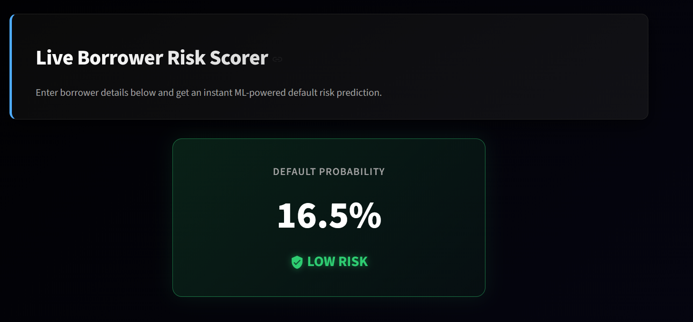
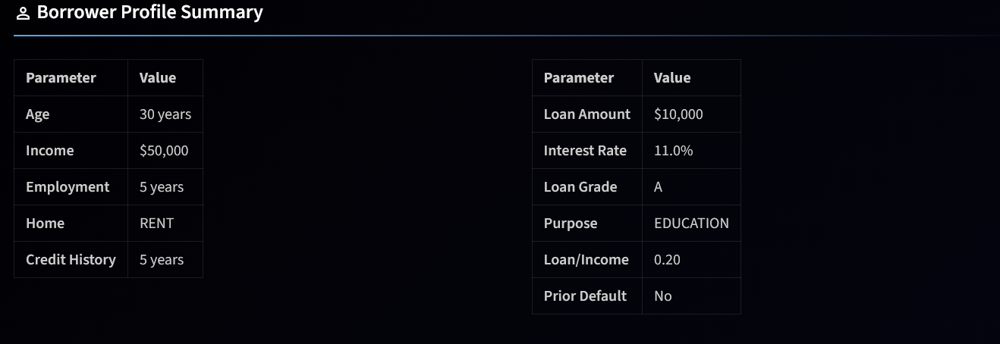
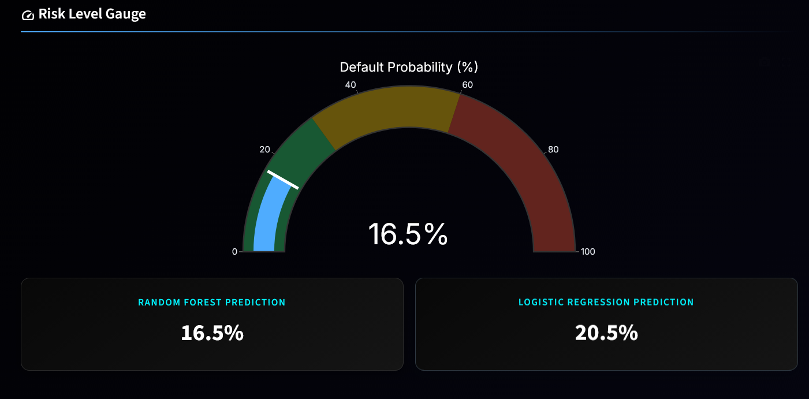
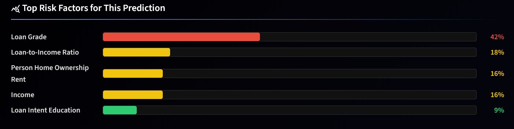
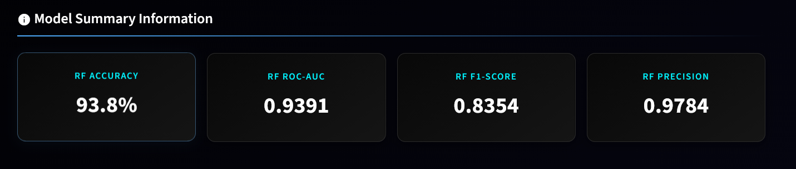

<div align="center">
  
</div>

# CreditIQ — Institutional Loan Default Predictor

An enterprise-grade, ML-powered web application designed to predict the probability of a borrower defaulting on a loan. The system accepts borrower profile inputs, evaluates them through trained classification models (Logistic Regression and Random Forest), and outputs an instant risk score with interpretability visualizations — simulating real-world credit risk systems used by financial institutions like JPMorgan Chase.


---

## Dashboard Previews

### Live Risk Scorer (The Core Feature)
*Real-time borrower default probability assessment based on a comprehensive input profile.*


### Borrower Profile Input
*Dynamic borrower profile data entry form.*


### Risk Level Gauge
*Intuitive, color-coded risk gauge indicating the predicted default risk.*


### Top Risk Factors
*Granular breakdown of risk factors dynamically driving the specific prediction.*


### Model Summary
*Detailed overview of model performance, metrics, and comparisons.*


---

## Key Features

### EDA Dashboard
- Dynamic distribution plots for age, income, and loan amounts (displayed in INR ₹).
- Default rate analysis segmented by loan grade (A–G) and loan purpose.
- Interactive feature correlation heatmap.
- Class imbalance visualizations highlighting real-world data challenges.

### Model Performance
- Direct, side-by-side performance comparison of Logistic Regression vs Random Forest.
- Interactive visualization of ROC curves and analytical confusion matrices.
- Clear metrics breakdown (Accuracy, Precision, Recall, F1-Score).
- Identification of top 10 feature importance rankings affecting default probability.

### Live Risk Scorer
- Dynamic borrower profile data entry form.
- Real-time application of Random Forest to instantly predict default probability.
- Intuitive, color-coded risk gauge (Low Risk, Medium Risk, High Risk).
- Granular breakdown of top risk factors dynamically driving the specific prediction.
- Currency-localized borrower inputs and summaries in Indian Rupees (₹).
- Loan amount input without an upper limit cap.

---

## Model Results

The project involved training models on highly imbalanced data requiring thoughtful preprocessing and scaling techniques. 

| Metric | Logistic Regression | Random Forest |
|:---:|:---:|:---:|
| **Accuracy** | 79.07% | **93.81%** (Best) |
| **Precision** | 50.92% | **97.84%** (Best) |
| **Recall** | **79.05%** (Best) | 72.89% |
| **F1-Score** | 61.94% | **83.54%** (Best) |
| **ROC-AUC** | 0.8680 | **0.9391** (Best) |

*The **Random Forest** classifier overwhelmingly performed the strongest, making it the primary model used for live risk assessments.*

---

## Technology Stack

| Architecture Layer | Technology |
|--------------------|------------|
| **Core Language** | Python 3.13 |
| **Machine Learning** | Scikit-learn, Joblib |
| **Data Pipeline & Processing** | Pandas, NumPy |
| **Interactive Visualization** | Plotly Express, Plotly Graph Objects, Seaborn, Matplotlib |
| **Frontend/UI Architecture** | Streamlit |
| **Dataset** | Kaggle Credit Risk Dataset (32,000+ records) |

---

## How to Run Locally

1. **Clone the repository:**
```bash
git clone https://github.com/Siddhantshukla1657/CreditIQ.git
cd CreditIQ
```

2. **Install dependencies:**
*(Note: Python 3.13 is recommended for optimal compatibility)*
```bash
py -3.13 -m pip install -r requirements.txt
```

3. **Train the classification models:**
```bash
py -3.13 model.py
```
*(This process creates all `/assets/` including the trained `.pkl` models and evaluation datasets needed for the dashboard)*

4. **Launch the dashboard:**
```bash
py -3.13 -m streamlit run app.py
```

5. **Interact:** Open your web browser at `http://localhost:8501`

---

## Project Structure

```text
CreditIQ/
├── app.py                  # Main Streamlit dashboard application
├── model.py                # Pipeline script for data cleaning, model training, and exporting
├── data/
│   └── credit_risk_dataset.csv   # Real-world Kaggle dataset containing 32,581 loan records
├── screenshots/            # Directory containing UI demonstration visuals
│   ├── borrower_profile.png
│   ├── model_summary.png
│   ├── risk_level_gauge.png
│   ├── risk_result.png
│   └── top_risk_factors.png
├── assets/                 # Auto-generated directory for serialized models
│   ├── lr_model.pkl        # Serialized Logistic Regression Model
│   ├── rf_model.pkl        # Serialized Random Forest Model
│   ├── scaler.pkl          # Standardization scaler instance
│   ├── feature_names.pkl   # ML feature index mappings
│   └── metrics_data.pkl    # Serialized model performance evaluation dictionaries
├── requirements.txt        # Python package dependency list
└── README.md               # Extensive project documentation
```

---

## Dataset Overview

**Source:** [Kaggle — Credit Risk Dataset](https://www.kaggle.com/datasets/laotse/credit-risk-dataset)  
**Total Records:** ~32,581  
**Target Variable (Classification):** `loan_status` (0 = No Default, 1 = Default)

### Core Features Profile
| Raw Feature Name | Description Context |
|------------------|---------------------|
| `person_age` | Applicant's age |
| `person_income` | Annual reported income (displayed as INR ₹ in app UI) |
| `person_emp_length` | Total length of continuous employment (in years) |
| `loan_amnt` | Total requested credit/loan amount (displayed as INR ₹ in app UI) |
| `loan_int_rate` | Approved interest rate for the loan |
| `loan_percent_income` | Crucial risk metric: Loan-to-Income percentage |
| `loan_grade` | Standardized institutional risk grading assigned (A–G) |
| `loan_intent` | Self-reported primary purpose for the credit request |
| `cb_person_default_on_file` | Historical flag indicating prior defaults |
| `cb_person_cred_hist_length` | Length of established credit history (in years) |

---

## Author

**Siddhant Shukla**  
*Built as a portfolio project demonstrating an end-to-end Machine Learning pipeline applied to institutional credit risk analysis.*

---
